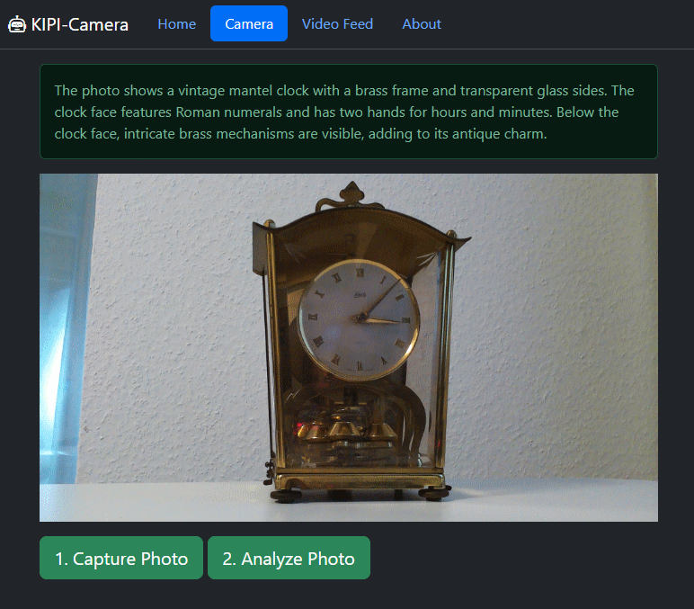
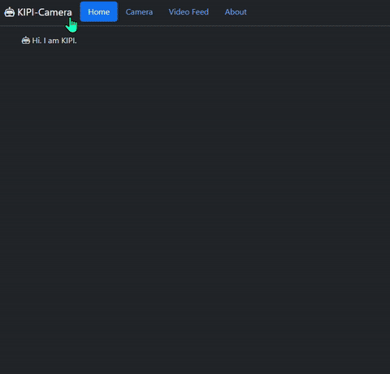
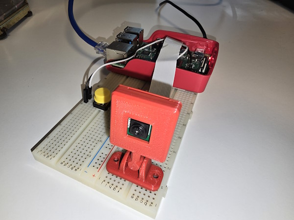
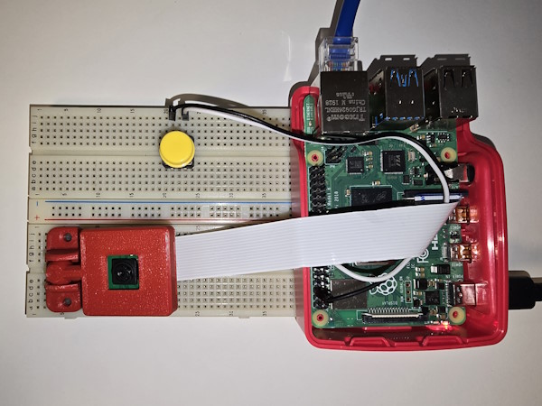
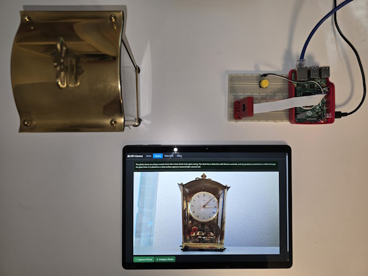
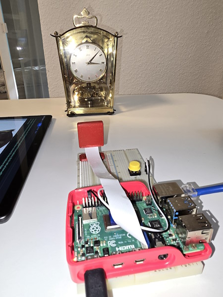

# kipi-camera
Analyze photos and get a detailed photo description with the help of 'OpenAI Vision' and a Raspberry Pi 4 with a camera module v1.3.

  

## Prerequisite
You'll need:
- Raspberry Pi 4 with Raspberry Pi OS (bookworm)
- Raspberry Pi Camera Module v1.3
- Installation of Python 3 on the Raspberry Pi 4

As of March 2024 the bookworm version of Raspberry Pi OS has come preinstalled with both Flask and Picamera2 meaning all you need to do is install git and clone this repository.

## Getting Started
On your Raspberry Pi 4 follow these steps to set up your device:

Update Raspberry Pi OS:
```shell
sudo apt update && sudo apt upgrade -y
```

Clone the repository to your Raspberry Pi:
```shell
git clone https://github.com/hascheel/kipi-camera.git
```

Create a Python virtual environment:
```shell
cd kipi-camera
python -m venv .venv
```

Activate the virtual environment:
```shell
# Linux:
source ./venv/bin/activate

# Windows:
.venv\Scripts\activate
```

Install Python libraries (optional: Picamera2 may already be installed):
```shell
sudo apt update && sudo apt upgrade -y
sudo apt install -y python3-picamera2
sudo apt install -y python3-opencv
```

Install Python dependencies with pip:
```shell
python -m pip install requests
python -m pip install opencv-python
python -m pip install picamera2
python -m pip install flask
python -m pip install openai
```

If you experience Python package compilation errors, or if some Python modules cannot be found, then include global Python packages to your Python virtual environment.

Open: *pyvenv.cfg* in *.venv* directory and change the following line:

```shell
# in pyvenv.cfg change the following line from:
include-system-site-packages = false
# to
include-system-site-packages = true
```

Type in your own OpenAI API key in the app.py file of each app.
````python
open_ai_api_key = 'TYPE IN YOUR OPENAI API KEY HERE!'
````

Write your own OpenAI prompt in the app.py.
```python
openaiPrompt = 'This is a photo. Describe the person in one sentence. If not: Describe in one sentence what you can see on the photo.'
```

## Start the app
- Navigate to your kipi-camera project folder.
- Activate Python virtual environment:

    ```shell
    # Linux:
    $ source ./venv/bin/activate

    # Windows:
    $ .venv\Scripts\activate
    ```

- Start the app:
    ```shell
    $ python app.py
    ```

- Open your Webbroser and navigate to: http://127.0.0.1:8001
- The app is also available on your current IP address of your computer on Port: 8001


## Problems
### App crashes when Python Debugger is enabled.
To prevent a crash during runtime or when the app stops working shortly after the start, disable the Python Debugger:

```python
if __name__ == "__main__":
    # Start the Flask development server and run the application.
    app.run(debug=False, host='0.0.0.0', port=8001)
```

## Gallery





## License
All my publications in this project are free to use and are subject to the MIT license.

MIT License:

Copyright (c) 2024 Hardy Scheel

Permission is hereby granted, free of charge, to any person obtaining a copy
of this software and associated documentation files (the "Software"), to deal
in the Software without restriction, including without limitation the rights
to use, copy, modify, merge, publish, distribute, sublicense, and/or sell
copies of the Software, and to permit persons to whom the Software is
furnished to do so, subject to the following conditions:

The above copyright notice and this permission notice shall be included in all
copies or substantial portions of the Software.

THE SOFTWARE IS PROVIDED "AS IS", WITHOUT WARRANTY OF ANY KIND, EXPRESS OR
IMPLIED, INCLUDING BUT NOT LIMITED TO THE WARRANTIES OF MERCHANTABILITY,
FITNESS FOR A PARTICULAR PURPOSE AND NONINFRINGEMENT. IN NO EVENT SHALL THE
AUTHORS OR COPYRIGHT HOLDERS BE LIABLE FOR ANY CLAIM, DAMAGES OR OTHER
LIABILITY, WHETHER IN AN ACTION OF CONTRACT, TORT OR OTHERWISE, ARISING FROM,
OUT OF OR IN CONNECTION WITH THE SOFTWARE OR THE USE OR OTHER DEALINGS IN THE
SOFTWARE.
